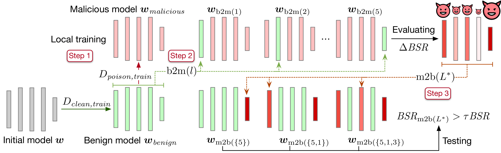

# [ICLR2024] Backdoor Federated Learning by Poisoning Backdoor-critical Layers

<p align="center"></p>

> **[Backdoor Federated Learning by Poisoning Backdoor-critical Layers](https://openreview.net/pdf?id=AJBGSVSTT2)**
>
> Haomin Zhuang, Mingxian Yu, Hao Wang, Yang Hua, Jian Li, Xu yuan


## Abstract
Federated learning (FL) has been widely deployed to enable machine learning training on sensitive data across distributed devices. However, the decentralized learning paradigm and heterogeneity of FL further extend the attack surface for backdoor attacks. Existing FL attack and defense methodologies typically focus on the whole model. None of them recognizes the existence of backdoor-critical (BC) layers-a small subset of layers that dominate the model vulnerabilities. Attacking the BC layers achieves equivalent effects as attacking the whole model but at a far smaller chance of being detected by state-of-the-art (SOTA) defenses. This paper proposes a general in-situ approach that identifies and verifies BC layers from the perspective of attackers. Based on the identified BC layers, we carefully craft a new backdoor attack methodology that adaptively seeks a fundamental balance between attacking effects and stealthiness under various defense strategies. Extensive experiments show that our BC layer-aware backdoor attacks can successfully backdoor FL under seven SOTA defenses with only 10% malicious clients and outperform the latest backdoor attack methods.
## Requirements
Python=3.9

pytorch=1.10.1

scikit-learn=1.0.2

opencv-python=4.5.5.64

Scikit-Image=0.19.2

matplotlib=3.4.3

hdbscan=0.8.28

jupyterlab=3.3.2

Install instruction are recorded in install_requirements.sh

If you fail to build up environment, please turn to './requirements_conda.txt' for more details.

## Quick Start

```
python main_fed.py --dataset cifar --model resnet --attack lp_attack --lr 0.1 --malicious 0.1 --poison_frac 1.0 --local_ep 2 --local_bs 64 --attack_begin 0 --defence flame --epochs 200 --attack_label 5 --attack_goal -1 --trigger 'square' --triggerX 27 --triggerY 27 --gpu 0 --iid 1 --save save/quick_start
```

